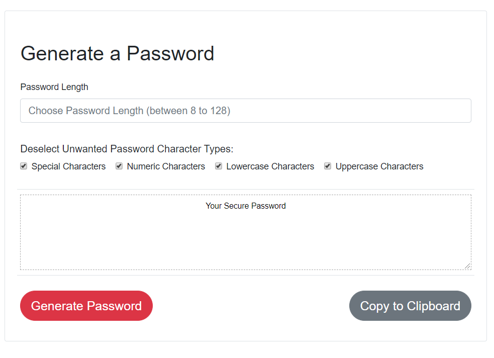

# Password Generator
##Homework 3 


###File structure
- PasswordGenerator
  - Index.html
  - assets
    - js
      - script.js
    - css
      - style.css
      - reset.css



After clicking the Generate Password Button, Application provides a password based on the selected character types and password length.


Copy to Clipboard button allows the user to copy the provided password.

 ### Copy to Clipboard function:
 .select() function works with input or textarea not div or paragraph elements.
```
 function copyFunction() {
          var copyText = document.getElementById("genPass");
          copyText.select();
          document.execCommand("Copy");
          alert("Copied the text: " + copyText);
     }
```
